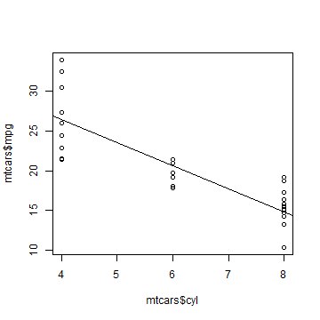
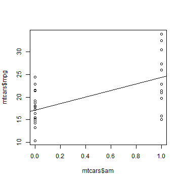
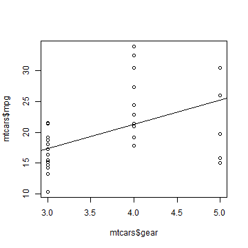

## Slide 2

Car Motor Regression Study

--- .class #id 

## Slide 3


```r
fit <- lm(mpg ~ cyl, data = mtcars)
plot(mtcars$cyl, mtcars$mpg)
abline(fit)
```

 

--- .class #id 

## Slide 4


```r
fit <- lm(mpg ~ am, data = mtcars)
plot(mtcars$am, mtcars$mpg)
abline(fit)
```

 

--- .class #id 

## Slide 5


```r
fit <- lm(mpg ~ gear, data = mtcars)
plot(mtcars$gear, mtcars$mpg)
abline(fit)
```

 


